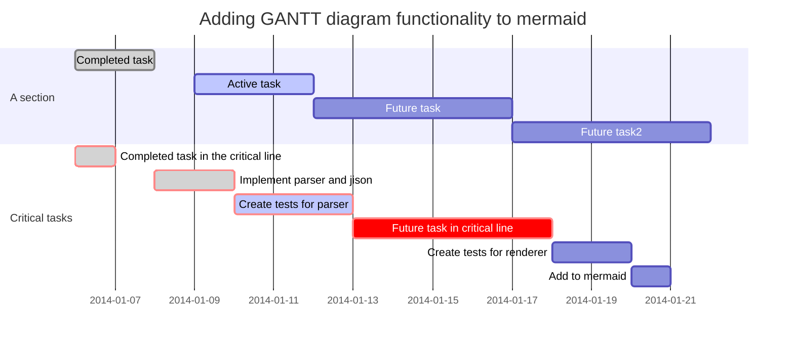

# pandoc-mermaid-filter

Pandoc filter which converts mermaid code blocks to mermaid images.

````

````

## Usage

Install it with pip:

```
pip install pandoc-mermaid-filter
```

And use it like any other pandoc filter:

```
pandoc tests/sample.md -o sample.html --filter pandoc-mermaid
pandoc tests/sample.md -o sample.pdf --filter pandoc-mermaid
```

The mermaid binary must be in your `$PATH` or can be set with the
`MERMAID_BIN` environment variable.

By setting the environment variable `PUPPETEER_CFG`, you can pass a custom
configuration file to `mermaid` (`-p` option).

### Windows Build

From source code checkout:

    pip install pandocfilters
    python -m pip install -e .

Should result in pandoc-mermaid.exe in path (note similar for Linux/Unix/Mac).

Alternatively:

    pip install pyinstaller
    pyinstaller pandoc_mermaid_filter.py  # onefile...

Copy/rename `dist\pandoc_mermaid_filter\pandoc_mermaid_filter.exe` into `pandoc-mermaid.exe`.
Add to path:

    path %PATH%;dist\pandoc_mermaid_filter

## But there is ...

There are a few other filters trying to convert mermaid code blocks however
they all failed for me.

### Troubleshoot

I've had to install the mermaid CLI locally instead of globally. See https://github.com/mermaidjs/mermaid.cli/issues/16
